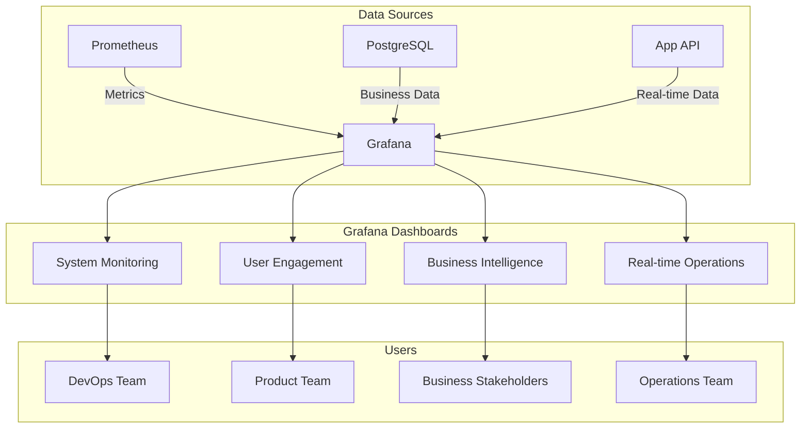

# Grafana Dashboard Setup Design

## Overview

This design document outlines the architecture and implementation approach for setting up comprehensive Grafana dashboards for the App Engagement Intelligence system. The solution will provide real-time monitoring, business intelligence, and operational insights through a well-structured dashboard hierarchy.

## Architecture

### System Architecture



### Dashboard Hierarchy

1. **System Monitoring Dashboard**
   - Infrastructure metrics
   - Application performance
   - Error tracking
   - Resource utilization

2. **User Engagement Dashboard**
   - User behavior analytics
   - Feature adoption metrics
   - Intervention effectiveness
   - Segmentation analysis

3. **Business Intelligence Dashboard**
   - Cost savings metrics
   - ROI calculations
   - Digital transformation progress
   - Executive summary views

4. **Real-time Operations Dashboard**
   - Live user activity
   - System health status
   - Alert management
   - Incident response

## Components and Interfaces

### Data Source Configuration

#### Prometheus Data Source
- **URL**: http://localhost:9091
- **Access**: Server (default)
- **Scrape Interval**: 15s
- **Query Timeout**: 60s
- **HTTP Method**: GET

#### PostgreSQL Data Source
- **Host**: localhost:5432
- **Database**: app_engagement_intelligence
- **User**: postgres
- **SSL Mode**: disable
- **Connection Limits**: 100
- **Query Timeout**: 30s

#### JSON API Data Source (for real-time data)
- **URL**: http://localhost:3000/api
- **Authentication**: None (development)
- **Refresh Rate**: 30s
- **Timeout**: 10s

### Dashboard Components

#### System Monitoring Panels
1. **CPU Usage** (Time Series)
   - Query: `rate(process_cpu_seconds_total[5m]) * 100`
   - Threshold: Warning at 70%, Critical at 90%

2. **Memory Usage** (Gauge)
   - Query: `process_resident_memory_bytes / 1024 / 1024`
   - Unit: MB
   - Max: System memory limit

3. **API Response Time** (Time Series)
   - Query: `histogram_quantile(0.95, rate(http_request_duration_seconds_bucket[5m]))`
   - Unit: seconds
   - Threshold: Warning at 1s, Critical at 2s

4. **Error Rate** (Stat)
   - Query: `rate(http_requests_total{status=~"5.."}[5m]) / rate(http_requests_total[5m]) * 100`
   - Unit: percent
   - Threshold: Warning at 1%, Critical at 5%

#### User Engagement Panels
1. **Active Users** (Stat)
   - Data Source: PostgreSQL
   - Query: `SELECT COUNT(DISTINCT user_id) FROM analytics.user_events WHERE timestamp > NOW() - INTERVAL '24 hours'`

2. **Digital Adoption Rate** (Gauge)
   - Data Source: PostgreSQL
   - Query: Complex query calculating digital vs traditional channel usage

3. **Feature Usage Heatmap** (Heatmap)
   - Data Source: PostgreSQL
   - X-axis: Time of day
   - Y-axis: Feature names
   - Value: Usage count

4. **Intervention Conversion Funnel** (Bar Chart)
   - Data Source: PostgreSQL
   - Stages: Sent → Delivered → Opened → Clicked → Converted

#### Business Intelligence Panels
1. **Cost Savings Trend** (Time Series)
   - Data Source: PostgreSQL
   - Calculation: Digital transactions × cost savings per transaction

2. **ROI Calculator** (Table)
   - Data Source: PostgreSQL
   - Columns: Investment, Savings, ROI %, Payback Period

3. **Call Volume Reduction** (Time Series)
   - Data Source: PostgreSQL
   - Comparison: Previous period vs current period

## Data Models

### Prometheus Metrics Schema
```yaml
# Application Metrics
http_requests_total:
  labels: [method, status, endpoint]
  type: counter

http_request_duration_seconds:
  labels: [method, endpoint]
  type: histogram

process_cpu_seconds_total:
  type: counter

process_resident_memory_bytes:
  type: gauge

# Custom Business Metrics
user_engagement_score:
  labels: [user_segment, age_group]
  type: gauge

intervention_conversion_rate:
  labels: [intervention_type, channel]
  type: gauge

cost_savings_total:
  labels: [period, channel]
  type: counter
```

### PostgreSQL Query Templates
```sql
-- Active Users Query
SELECT 
  DATE_TRUNC('hour', timestamp) as time,
  COUNT(DISTINCT user_id) as active_users
FROM analytics.user_events 
WHERE timestamp > $__timeFrom() AND timestamp < $__timeTo()
GROUP BY time
ORDER BY time;

-- Digital Adoption Rate Query
SELECT 
  DATE_TRUNC('day', timestamp) as time,
  (COUNT(CASE WHEN event_type = 'task_completion' THEN 1 END) * 100.0 / 
   COUNT(*)) as adoption_rate
FROM analytics.user_events 
WHERE timestamp > $__timeFrom() AND timestamp < $__timeTo()
GROUP BY time
ORDER BY time;

-- Cost Savings Query
SELECT 
  DATE_TRUNC('day', created_at) as time,
  SUM(digital_tasks_completed * 5.0) as cost_savings
FROM analytics.user_profiles 
WHERE created_at > $__timeFrom() AND created_at < $__timeTo()
GROUP BY time
ORDER BY time;
```

## Error Handling

### Data Source Connection Errors
- **Prometheus Unavailable**: Display "Metrics Unavailable" message
- **PostgreSQL Connection Failed**: Show cached data with timestamp
- **API Timeout**: Retry with exponential backoff
- **Query Errors**: Log error and display user-friendly message

### Dashboard Loading Errors
- **Panel Load Failure**: Show error state with retry button
- **Data Parsing Errors**: Display raw data with warning
- **Timeout Handling**: Show loading spinner with timeout message
- **Permission Errors**: Redirect to login or show access denied

### Alert Configuration Errors
- **Invalid Thresholds**: Validate and show configuration errors
- **Notification Failures**: Log and retry with different channels
- **Rule Evaluation Errors**: Disable rule and notify administrators

## Testing Strategy

### Unit Testing
- Data source connection validation
- Query syntax verification
- Panel configuration validation
- Alert rule testing

### Integration Testing
- End-to-end dashboard loading
- Data source integration
- Real-time data updates
- Cross-panel interactions

### Performance Testing
- Dashboard load times
- Query performance optimization
- Concurrent user handling
- Memory usage monitoring

### User Acceptance Testing
- Role-based access verification
- Dashboard usability testing
- Mobile responsiveness
- Export functionality validation

## Security Considerations

### Authentication and Authorization
- Default admin credentials change
- Role-based dashboard access
- API key management for data sources
- Session timeout configuration

### Data Security
- Database connection encryption
- Query parameter sanitization
- Sensitive data masking
- Audit logging for access

### Network Security
- Internal network access only
- HTTPS configuration for production
- Firewall rules for data sources
- VPN access for remote users

## Performance Optimization

### Query Optimization
- Index creation for frequently queried columns
- Query result caching
- Aggregation pre-calculation
- Time range optimization

### Dashboard Performance
- Panel lazy loading
- Data refresh rate optimization
- Browser caching configuration
- CDN for static assets

### Resource Management
- Memory usage monitoring
- CPU utilization optimization
- Database connection pooling
- Grafana instance scaling

## Deployment Configuration

### Environment Variables
```bash
# Grafana Configuration
GF_SECURITY_ADMIN_PASSWORD=secure_password
GF_USERS_ALLOW_SIGN_UP=false
GF_AUTH_ANONYMOUS_ENABLED=false

# Database Configuration
GF_DATABASE_TYPE=postgres
GF_DATABASE_HOST=localhost:5432
GF_DATABASE_NAME=grafana
GF_DATABASE_USER=grafana
GF_DATABASE_PASSWORD=grafana_password

# SMTP Configuration (for alerts)
GF_SMTP_ENABLED=true
GF_SMTP_HOST=smtp.gmail.com:587
GF_SMTP_USER=alerts@company.com
GF_SMTP_PASSWORD=smtp_password
```

### Docker Configuration Updates
```yaml
# Additional Grafana service configuration
grafana:
  environment:
    - GF_SECURITY_ADMIN_PASSWORD=admin123
    - GF_USERS_ALLOW_SIGN_UP=false
    - GF_INSTALL_PLUGINS=grafana-piechart-panel,grafana-worldmap-panel
  volumes:
    - ./monitoring/grafana/dashboards:/var/lib/grafana/dashboards
    - ./monitoring/grafana/provisioning:/etc/grafana/provisioning
```

## Monitoring and Maintenance

### Health Checks
- Grafana service availability
- Data source connectivity
- Dashboard load performance
- Alert rule functionality

### Backup and Recovery
- Dashboard configuration backup
- Data source configuration export
- User and permission backup
- Automated backup scheduling

### Updates and Maintenance
- Grafana version updates
- Plugin management
- Dashboard version control
- Performance monitoring and optimization