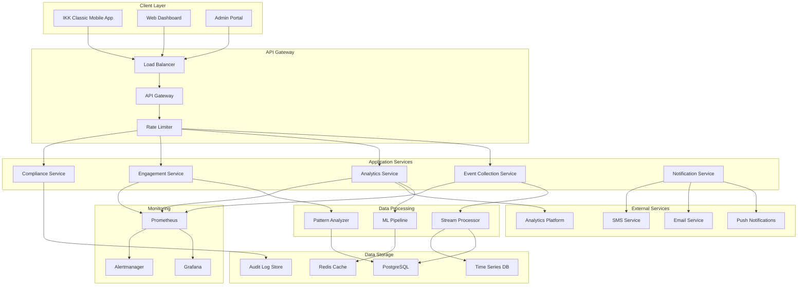
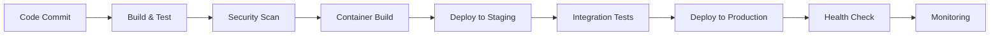

# App Engagement Intelligence - How Everything Works Together

## What This System Does

Imagine having a smart friend who watches how people use your app, figures out when they might need help, and then sends them just the right message at the perfect moment. That's basically what our App Engagement Intelligence system does! 

It's built like a well-organized team where each member has a specific job - some collect information, others analyze it, and some take action based on what they learned. The whole system is designed to help users have a better experience with your app while keeping their privacy safe and sound.

## Our Guiding Principles

Think of these as our "house rules" - everything we build follows these principles:

1. **Privacy First, Always**: We treat user data like it's our own family's information - with the utmost care and respect for GDPR and GDNG rules
2. **Grows With You**: As your user base expands, our system scales up smoothly without missing a beat
3. **Built to Last**: When things go wrong (and they sometimes do), our system gracefully handles problems and keeps running
4. **Real-Time Reactions**: We process events as they happen, so users get help when they need it most
5. **Compliance is Key**: Every action is logged and auditable - we keep detailed records for regulatory compliance

## The Big Picture - How It All Fits Together

Here's how our system is organized - think of it like a well-designed city with different districts:



## Our Team of Digital Workers

Think of our system as a well-organized team where each member has a specific role. Let me introduce you to the key players:

### 1. The Event Collector - Our Information Gatherer

**What they do**: This is like having a really observant assistant who notices everything users do in your app and carefully records it.

**Their responsibilities**:
- Listen for user actions (taps, swipes, form submissions, etc.)
- Check if the user has given permission to track their activity
- Remove or hide any personally identifiable information to protect privacy
- Store events temporarily for efficient processing

**Tools they use**:
- Node.js and TypeScript (for fast, reliable processing)
- Express.js (to handle incoming requests)
- Redis (for temporary storage)
- JSON Schema (to make sure data is properly formatted)

**How they handle busy periods**:
- They can call in backup workers when traffic gets heavy
- They group events together for efficient processing
- They have backup plans when external services are down

### 2. The Analytics Expert - Our Data Detective

**What they do**: This team member is like Sherlock Holmes for your app data - they spot patterns, trends, and insights that help you understand your users better.

**Their superpowers**:
- Process events as they happen (real-time analysis)
- Spot interesting patterns in user behavior
- Group users into meaningful segments (like "new users who love mobile claims")
- Track important metrics to measure success

**Tools in their toolkit**:
- Apache Kafka for handling streams of data
- PostgreSQL for organized data storage
- InfluxDB for time-based metrics
- Redis for quick data access

**How they work**:
1. Receive fresh events from the Event Collector
2. Look for patterns and interesting behaviors
3. Update user profiles and create segments
4. Calculate and store important metrics

### 3. The Engagement Specialist - Our Helpful Messenger

**What they do**: This is your app's personal concierge - they figure out exactly when and how to help each user, then deliver perfectly timed, helpful messages.

**Key Components**:
- Recommendation Engine: ML-based intervention recommendations
- Content Personalizer: Age and literacy-appropriate content
- Intervention Orchestrator: Multi-channel delivery coordination
- Response Tracker: Measures intervention effectiveness

**Technologies**:
- Python/scikit-learn for ML models
- Node.js for API services
- Redis for session management
- PostgreSQL for intervention data

**ML Pipeline**:
1. Feature extraction from user events
2. Behavioral pattern classification
3. Intervention strategy selection
4. Content personalization
5. Delivery optimization

### 4. Compliance Service

**Purpose**: Ensures GDPR/GDNG compliance throughout the system.

**Key Components**:
- Consent Manager: Granular consent collection and management
- Data Retention Manager: Automated data lifecycle management
- Audit Logger: Comprehensive audit trail
- Privacy Rights Handler: Data subject request processing

**Technologies**:
- PostgreSQL for consent records
- Immutable audit log storage
- Automated data purging
- Encryption for sensitive data

**Compliance Features**:
- Consent versioning and history
- Right to be forgotten (GDPR Article 17)
- Data portability (GDPR Article 20)
- Breach notification automation

### 5. Notification Service

**Purpose**: Delivers interventions across multiple communication channels.

**Key Components**:
- Channel Router: Optimal channel selection
- Delivery Handlers: Channel-specific delivery logic
- Retry Manager: Failed delivery handling
- Delivery Tracker: Status monitoring

**Supported Channels**:
- Push notifications (FCM)
- Email (SendGrid)
- SMS (Twilio)
- In-app notifications

**Delivery Strategy**:
- Channel preference optimization
- Fallback channel selection
- Rate limiting per user
- Delivery confirmation tracking

## Data Architecture

### Data Models

#### User Profile
```typescript
interface UserProfile {
  userId: string; // pseudonymized
  demographics: {
    ageGroup: '22-30' | '31-40' | '41-55' | '56-65' | '66+';
    registrationDate: Date;
    lastActiveDate: Date;
  };
  engagementMetrics: {
    totalSessions: number;
    averageSessionDuration: number;
    featuresUsed: string[];
    digitalTasksCompleted: number;
    traditionalChannelUsage: {
      phoneCallsLastMonth: number;
      paperFormsLastMonth: number;
    };
  };
  preferences: {
    communicationChannels: string[];
    notificationFrequency: 'high' | 'medium' | 'low';
    contentComplexity: 'simple' | 'detailed';
  };
  consentStatus: ConsentRecord[];
}
```

#### User Event
```typescript
interface UserEvent {
  eventId: string;
  userId: string; // pseudonymized
  sessionId: string;
  timestamp: Date;
  eventType: 'page_view' | 'feature_usage' | 'task_completion' | 'abandonment';
  metadata: {
    screenName?: string;
    featureId?: string;
    duration?: number;
    success?: boolean;
  };
  userContext: {
    ageGroup: string;
    digitalLiteracyScore?: number;
    preferredChannel?: string;
  };
}
```

### Data Storage Strategy

#### PostgreSQL (Primary Database)
- User profiles and consent records
- Intervention strategies and campaigns
- Audit logs and compliance data
- Structured analytics data

#### Redis (Cache & Session Store)
- User session data
- Temporary event buffers
- ML model predictions cache
- Rate limiting counters

#### InfluxDB (Time Series)
- User interaction events
- System performance metrics
- Intervention delivery metrics
- Real-time analytics data

#### Audit Log Store (Immutable)
- Compliance audit trail
- Data processing logs
- Consent change history
- System access logs

## Security Architecture

### Authentication & Authorization
- JWT-based authentication
- Role-based access control (RBAC)
- API key management for external integrations
- Multi-factor authentication for admin access

### Data Protection
- Encryption at rest (AES-256)
- Encryption in transit (TLS 1.3)
- Data pseudonymization and anonymization
- Secure key management (HashiCorp Vault)

### Network Security
- VPC with private subnets
- Web Application Firewall (WAF)
- DDoS protection
- Network segmentation

### Compliance Controls
- Data minimization by design
- Purpose limitation enforcement
- Automated data retention policies
- Regular security audits

## Deployment Architecture

### Container Strategy
- Docker containers for all services
- Multi-stage builds for optimization
- Distroless base images for security
- Health checks and graceful shutdown

### Orchestration
- Kubernetes for container orchestration
- Helm charts for deployment management
- Horizontal Pod Autoscaler (HPA)
- Cluster autoscaling

### Environment Strategy
- Development: Docker Compose
- Staging: Kubernetes cluster
- Production: Multi-zone Kubernetes

### CI/CD Pipeline


## Monitoring & Observability

### Metrics Collection
- Application metrics (Prometheus)
- Infrastructure metrics (Node Exporter)
- Custom business metrics
- SLA/SLO monitoring

### Logging Strategy
- Structured logging (JSON format)
- Centralized log aggregation (ELK Stack)
- Log retention policies
- Security event logging

### Distributed Tracing
- Request tracing across services
- Performance bottleneck identification
- Error propagation tracking
- User journey visualization

### Alerting
- Proactive alerting on SLA breaches
- Compliance violation alerts
- Security incident notifications
- Capacity planning alerts

## Performance Characteristics

### Scalability Targets
- **Throughput**: 10,000 events/second
- **Latency**: <100ms for event processing
- **Availability**: 99.9% uptime SLA
- **Users**: Support for 1M+ active users

### Performance Optimizations
- Event batching and buffering
- Database connection pooling
- Redis caching strategies
- CDN for static content

### Load Testing Strategy
- Continuous load testing in staging
- Chaos engineering practices
- Performance regression testing
- Capacity planning automation

## Disaster Recovery

### Backup Strategy
- Automated daily database backups
- Cross-region backup replication
- Point-in-time recovery capability
- Backup integrity verification

### High Availability
- Multi-zone deployment
- Database clustering with failover
- Load balancer health checks
- Circuit breaker patterns

### Recovery Procedures
- RTO (Recovery Time Objective): 4 hours
- RPO (Recovery Point Objective): 1 hour
- Automated failover procedures
- Regular disaster recovery testing

## Future Architecture Considerations

### Planned Enhancements
- Machine learning model serving platform
- Real-time personalization engine
- Advanced analytics with data lake
- Multi-tenant architecture support

### Technology Evolution
- Migration to event sourcing pattern
- Adoption of serverless functions
- GraphQL API gateway
- Edge computing for low latency

### Scalability Roadmap
- Microservices decomposition
- Event-driven architecture expansion
- Global content delivery network
- Multi-region deployment strategy

## Development Guidelines

### Code Organization
```
src/
├── analytics/          # Analytics service components
├── engagement/         # Engagement service components
├── compliance/         # Compliance service components
├── api/               # API layer and routing
├── config/            # Configuration management
├── types/             # TypeScript type definitions
├── error-handling/    # Error handling utilities
└── integration/       # Integration tests
```

### API Design Principles
- RESTful API design
- Consistent error handling
- Comprehensive API documentation
- Versioning strategy
- Rate limiting and throttling

### Testing Strategy
- Unit tests (>80% coverage)
- Integration tests
- End-to-end tests
- Performance tests
- Security tests

### Documentation Standards
- API documentation (OpenAPI/Swagger)
- Architecture decision records (ADRs)
- Runbook documentation
- Code documentation standards