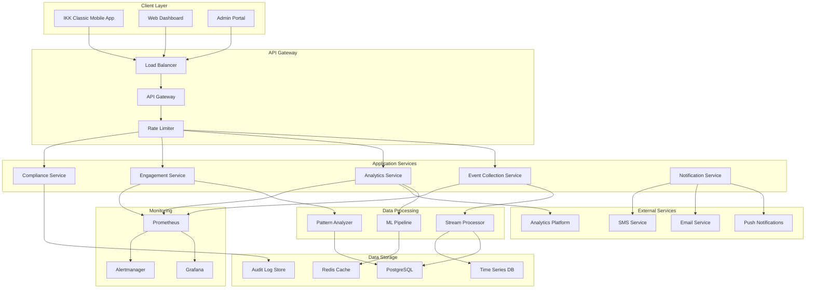
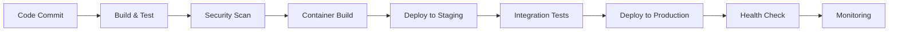

# App Engagement Intelligence - System Architecture

## Overview

The App Engagement Intelligence system is designed as a microservices-based platform that analyzes user behavior, generates personalized interventions, and ensures GDPR/GDNG compliance. The system processes user interaction events in real-time and delivers targeted interventions across multiple channels to improve digital adoption.

## Architecture Principles

1. **Privacy by Design**: All data processing adheres to GDPR and GDNG requirements
2. **Scalability**: Horizontally scalable microservices architecture
3. **Resilience**: Circuit breakers, retry mechanisms, and graceful degradation
4. **Real-time Processing**: Event-driven architecture for immediate response
5. **Compliance First**: Built-in audit trails and consent management

## High-Level Architecture



## Component Architecture

### 1. Event Collection Service

**Purpose**: Collects and validates user interaction events from mobile app and web interfaces.

**Key Components**:
- Event Collector: Receives and validates incoming events
- Consent Validator: Ensures user consent before processing
- Data Anonymizer: Pseudonymizes sensitive data
- Event Buffer: Temporary storage for batch processing

**Technologies**:
- Node.js/TypeScript
- Express.js for REST API
- Redis for buffering
- JSON Schema for validation

**Scaling Strategy**:
- Horizontal scaling with load balancer
- Event buffering for high throughput
- Circuit breakers for external dependencies

### 2. Analytics Service

**Purpose**: Processes events to generate insights, user segments, and behavioral patterns.

**Key Components**:
- Stream Processor: Real-time event processing
- Pattern Analyzer: Identifies user behavior patterns
- Segmentation Engine: Dynamic user segmentation
- Metrics Collector: Aggregates performance metrics

**Technologies**:
- Apache Kafka/Pulsar for streaming
- PostgreSQL for structured data
- InfluxDB for time-series data
- Redis for caching

**Data Flow**:
1. Events received from Event Collection Service
2. Real-time processing and pattern detection
3. User profile updates and segmentation
4. Metrics aggregation and storage

### 3. Engagement Service

**Purpose**: Generates and delivers personalized interventions based on user behavior and segments.

**Key Components**:
- Recommendation Engine: ML-based intervention recommendations
- Content Personalizer: Age and literacy-appropriate content
- Intervention Orchestrator: Multi-channel delivery coordination
- Response Tracker: Measures intervention effectiveness

**Technologies**:
- Python/scikit-learn for ML models
- Node.js for API services
- Redis for session management
- PostgreSQL for intervention data

**ML Pipeline**:
1. Feature extraction from user events
2. Behavioral pattern classification
3. Intervention strategy selection
4. Content personalization
5. Delivery optimization

### 4. Compliance Service

**Purpose**: Ensures GDPR/GDNG compliance throughout the system.

**Key Components**:
- Consent Manager: Granular consent collection and management
- Data Retention Manager: Automated data lifecycle management
- Audit Logger: Comprehensive audit trail
- Privacy Rights Handler: Data subject request processing

**Technologies**:
- PostgreSQL for consent records
- Immutable audit log storage
- Automated data purging
- Encryption for sensitive data

**Compliance Features**:
- Consent versioning and history
- Right to be forgotten (GDPR Article 17)
- Data portability (GDPR Article 20)
- Breach notification automation

### 5. Notification Service

**Purpose**: Delivers interventions across multiple communication channels.

**Key Components**:
- Channel Router: Optimal channel selection
- Delivery Handlers: Channel-specific delivery logic
- Retry Manager: Failed delivery handling
- Delivery Tracker: Status monitoring

**Supported Channels**:
- Push notifications (FCM)
- Email (SendGrid)
- SMS (Twilio)
- In-app notifications

**Delivery Strategy**:
- Channel preference optimization
- Fallback channel selection
- Rate limiting per user
- Delivery confirmation tracking

## Data Architecture

### Data Models

#### User Profile
```typescript
interface UserProfile {
  userId: string; // pseudonymized
  demographics: {
    ageGroup: '22-30' | '31-40' | '41-55' | '56-65' | '66+';
    registrationDate: Date;
    lastActiveDate: Date;
  };
  engagementMetrics: {
    totalSessions: number;
    averageSessionDuration: number;
    featuresUsed: string[];
    digitalTasksCompleted: number;
    traditionalChannelUsage: {
      phoneCallsLastMonth: number;
      paperFormsLastMonth: number;
    };
  };
  preferences: {
    communicationChannels: string[];
    notificationFrequency: 'high' | 'medium' | 'low';
    contentComplexity: 'simple' | 'detailed';
  };
  consentStatus: ConsentRecord[];
}
```

#### User Event
```typescript
interface UserEvent {
  eventId: string;
  userId: string; // pseudonymized
  sessionId: string;
  timestamp: Date;
  eventType: 'page_view' | 'feature_usage' | 'task_completion' | 'abandonment';
  metadata: {
    screenName?: string;
    featureId?: string;
    duration?: number;
    success?: boolean;
  };
  userContext: {
    ageGroup: string;
    digitalLiteracyScore?: number;
    preferredChannel?: string;
  };
}
```

### Data Storage Strategy

#### PostgreSQL (Primary Database)
- User profiles and consent records
- Intervention strategies and campaigns
- Audit logs and compliance data
- Structured analytics data

#### Redis (Cache & Session Store)
- User session data
- Temporary event buffers
- ML model predictions cache
- Rate limiting counters

#### InfluxDB (Time Series)
- User interaction events
- System performance metrics
- Intervention delivery metrics
- Real-time analytics data

#### Audit Log Store (Immutable)
- Compliance audit trail
- Data processing logs
- Consent change history
- System access logs

## Security Architecture

### Authentication & Authorization
- JWT-based authentication
- Role-based access control (RBAC)
- API key management for external integrations
- Multi-factor authentication for admin access

### Data Protection
- Encryption at rest (AES-256)
- Encryption in transit (TLS 1.3)
- Data pseudonymization and anonymization
- Secure key management (HashiCorp Vault)

### Network Security
- VPC with private subnets
- Web Application Firewall (WAF)
- DDoS protection
- Network segmentation

### Compliance Controls
- Data minimization by design
- Purpose limitation enforcement
- Automated data retention policies
- Regular security audits

## Deployment Architecture

### Container Strategy
- Docker containers for all services
- Multi-stage builds for optimization
- Distroless base images for security
- Health checks and graceful shutdown

### Orchestration
- Kubernetes for container orchestration
- Helm charts for deployment management
- Horizontal Pod Autoscaler (HPA)
- Cluster autoscaling

### Environment Strategy
- Development: Docker Compose
- Staging: Kubernetes cluster
- Production: Multi-zone Kubernetes

### CI/CD Pipeline


## Monitoring & Observability

### Metrics Collection
- Application metrics (Prometheus)
- Infrastructure metrics (Node Exporter)
- Custom business metrics
- SLA/SLO monitoring

### Logging Strategy
- Structured logging (JSON format)
- Centralized log aggregation (ELK Stack)
- Log retention policies
- Security event logging

### Distributed Tracing
- Request tracing across services
- Performance bottleneck identification
- Error propagation tracking
- User journey visualization

### Alerting
- Proactive alerting on SLA breaches
- Compliance violation alerts
- Security incident notifications
- Capacity planning alerts

## Performance Characteristics

### Scalability Targets
- **Throughput**: 10,000 events/second
- **Latency**: <100ms for event processing
- **Availability**: 99.9% uptime SLA
- **Users**: Support for 1M+ active users

### Performance Optimizations
- Event batching and buffering
- Database connection pooling
- Redis caching strategies
- CDN for static content

### Load Testing Strategy
- Continuous load testing in staging
- Chaos engineering practices
- Performance regression testing
- Capacity planning automation

## Disaster Recovery

### Backup Strategy
- Automated daily database backups
- Cross-region backup replication
- Point-in-time recovery capability
- Backup integrity verification

### High Availability
- Multi-zone deployment
- Database clustering with failover
- Load balancer health checks
- Circuit breaker patterns

### Recovery Procedures
- RTO (Recovery Time Objective): 4 hours
- RPO (Recovery Point Objective): 1 hour
- Automated failover procedures
- Regular disaster recovery testing

## Future Architecture Considerations

### Planned Enhancements
- Machine learning model serving platform
- Real-time personalization engine
- Advanced analytics with data lake
- Multi-tenant architecture support

### Technology Evolution
- Migration to event sourcing pattern
- Adoption of serverless functions
- GraphQL API gateway
- Edge computing for low latency

### Scalability Roadmap
- Microservices decomposition
- Event-driven architecture expansion
- Global content delivery network
- Multi-region deployment strategy

## Development Guidelines

### Code Organization
```
src/
├── analytics/          # Analytics service components
├── engagement/         # Engagement service components
├── compliance/         # Compliance service components
├── api/               # API layer and routing
├── config/            # Configuration management
├── types/             # TypeScript type definitions
├── error-handling/    # Error handling utilities
└── integration/       # Integration tests
```

### API Design Principles
- RESTful API design
- Consistent error handling
- Comprehensive API documentation
- Versioning strategy
- Rate limiting and throttling

### Testing Strategy
- Unit tests (>80% coverage)
- Integration tests
- End-to-end tests
- Performance tests
- Security tests

### Documentation Standards
- API documentation (OpenAPI/Swagger)
- Architecture decision records (ADRs)
- Runbook documentation
- Code documentation standards