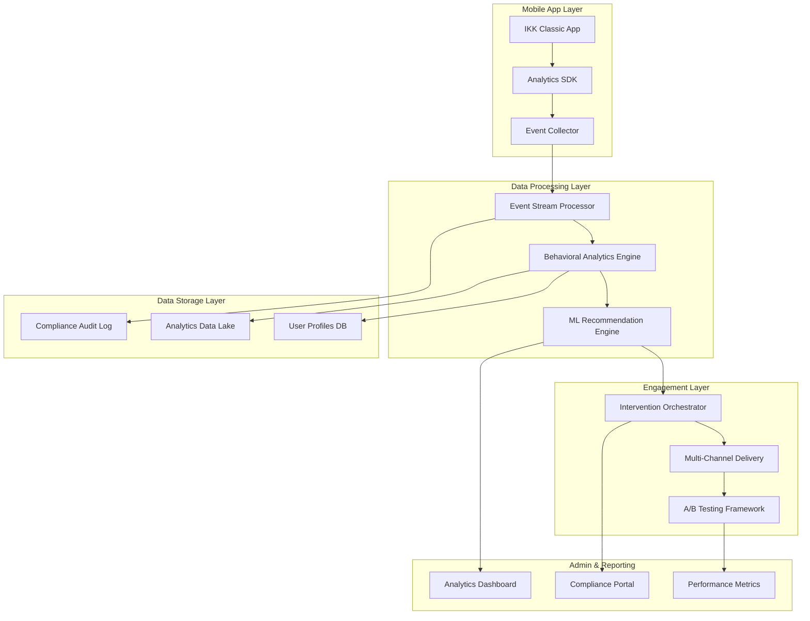

# Design Document - The Story Behind Our Decisions

## What We Built and Why

Picture this: You've got a fantastic mobile app, but you're not quite sure how people are using it. Are they getting stuck somewhere? Do they love certain features? Are there opportunities to help them succeed? That's exactly the problem we set out to solve!

Our App Engagement Intelligence system is like having a really smart, privacy-conscious friend watching over your app users. It notices patterns, spots opportunities to help, and delivers just the right message at just the right time. Think of it as three core pieces working together:

1. **The Observer** - Watches what users do (with their permission!) and learns from their behavior
2. **The Thinker** - Uses AI to understand patterns and figure out how to help users succeed  
3. **The Helper** - Makes sure everything follows privacy rules while keeping detailed records

The whole system is built with one key principle: help users have a better experience while respecting their privacy and following all the rules (especially German health data regulations).

We process user interactions as they happen, run them through smart algorithms to identify when someone might need help, and then send perfectly timed messages through their preferred channel - whether that's a gentle in-app nudge, a push notification, SMS, or email. Every step is designed to reduce support calls, save time, and make users happier.

## How Everything Connects

Here's a bird's-eye view of how our system works - imagine it like a well-designed factory where each station has a specific job:



### Data Flow Architecture

The system follows a privacy-by-design approach with data minimization and purpose limitation:

1. **Event Collection**: Client-side SDK captures user interactions with explicit consent
2. **Stream Processing**: Real-time event processing with immediate anonymization where possible
3. **Behavioral Analysis**: Pattern recognition and user segmentation based on engagement metrics
4. **Intervention Generation**: AI-powered recommendation engine creates personalized engagement strategies
5. **Delivery & Measurement**: Multi-channel delivery with real-time effectiveness tracking

## Components and Interfaces

### 1. Behavioral Tracking Engine

**Purpose**: Captures and processes user interaction data while maintaining privacy compliance.

**Key Components**:
- **Event Collector**: Lightweight SDK integrated into the mobile app
- **Stream Processor**: Real-time event processing using Apache Kafka/Pulsar
- **Data Anonymizer**: Immediate pseudonymization of sensitive data
- **Consent Manager**: GDPR/GDNG compliant consent collection and management

**Interfaces**:
```typescript
interface UserEvent {
  eventId: string;
  userId: string; // pseudonymized
  sessionId: string;
  timestamp: Date;
  eventType: 'page_view' | 'feature_usage' | 'task_completion' | 'abandonment';
  metadata: {
    screenName?: string;
    featureId?: string;
    duration?: number;
    success?: boolean;
  };
  userContext: {
    ageGroup: string;
    digitalLiteracyScore?: number;
    preferredChannel?: string;
  };
}

interface ConsentRecord {
  userId: string;
  consentType: 'analytics' | 'personalization' | 'marketing';
  granted: boolean;
  timestamp: Date;
  version: string;
}
```

### 2. AI-Powered Engagement Engine

**Purpose**: Analyzes user behavior patterns and generates personalized engagement strategies.

**Key Components**:
- **Pattern Recognition**: ML models to identify user journey patterns and abandonment points
- **Segmentation Engine**: Dynamic user segmentation based on behavior and demographics
- **Recommendation Generator**: Personalized intervention recommendations
- **Effectiveness Predictor**: Models to predict intervention success rates

**Interfaces**:
```typescript
interface UserSegment {
  segmentId: string;
  name: string;
  criteria: {
    ageRange?: [number, number];
    engagementLevel: 'low' | 'medium' | 'high';
    preferredChannels: string[];
    digitalLiteracy: 'beginner' | 'intermediate' | 'advanced';
  };
  interventionStrategies: InterventionStrategy[];
}

interface InterventionStrategy {
  strategyId: string;
  type: 'nudge' | 'incentive' | 'education' | 'gamification';
  trigger: {
    eventType: string;
    conditions: Record<string, any>;
  };
  content: {
    title: string;
    message: string;
    actionButton?: string;
    mediaUrl?: string;
  };
  channels: ('push' | 'in_app' | 'sms' | 'email')[];
  timing: {
    delay?: number;
    frequency?: string;
    expiresAfter?: number;
  };
}
```

### 3. Multi-Channel Intervention Delivery

**Purpose**: Delivers personalized interventions across multiple communication channels.

**Key Components**:
- **Channel Router**: Determines optimal delivery channel based on user preferences
- **Content Personalizer**: Adapts message content for different age groups and literacy levels
- **Delivery Scheduler**: Manages timing and frequency of interventions
- **Response Tracker**: Measures user response and engagement with interventions

**Interfaces**:
```typescript
interface DeliveryRequest {
  userId: string;
  interventionId: string;
  channel: 'push' | 'in_app' | 'sms' | 'email';
  content: PersonalizedContent;
  scheduledFor: Date;
  expiresAt: Date;
}

interface PersonalizedContent {
  title: string;
  message: string;
  callToAction?: string;
  visualElements?: {
    iconUrl?: string;
    imageUrl?: string;
    color?: string;
  };
  accessibility: {
    fontSize?: 'normal' | 'large' | 'extra_large';
    highContrast?: boolean;
    screenReaderText?: string;
  };
}
```

### 4. Compliance and Privacy Management

**Purpose**: Ensures all data processing complies with GDPR and GDNG regulations.

**Key Components**:
- **Consent Management Platform**: Granular consent collection and management
- **Data Retention Manager**: Automated data lifecycle management
- **Audit Logger**: Comprehensive audit trail for all data processing activities
- **Privacy Rights Handler**: Automated handling of data subject requests

## Data Models

### User Profile Model
```typescript
interface UserProfile {
  userId: string; // pseudonymized identifier
  demographics: {
    ageGroup: '22-30' | '31-40' | '41-55' | '56-65' | '66+';
    registrationDate: Date;
    lastActiveDate: Date;
  };
  engagementMetrics: {
    totalSessions: number;
    averageSessionDuration: number;
    featuresUsed: string[];
    digitalTasksCompleted: number;
    traditionalChannelUsage: {
      phoneCallsLastMonth: number;
      paperFormsLastMonth: number;
    };
  };
  preferences: {
    communicationChannels: string[];
    notificationFrequency: 'high' | 'medium' | 'low';
    contentComplexity: 'simple' | 'detailed';
  };
  consentStatus: ConsentRecord[];
}
```

### Analytics Event Model
```typescript
interface AnalyticsEvent {
  eventId: string;
  userId: string;
  sessionId: string;
  timestamp: Date;
  eventType: string;
  properties: {
    screenName?: string;
    featureId?: string;
    actionType?: string;
    duration?: number;
    success?: boolean;
    errorCode?: string;
  };
  context: {
    appVersion: string;
    deviceType: string;
    osVersion: string;
    networkType: string;
  };
}
```

### Intervention Campaign Model
```typescript
interface InterventionCampaign {
  campaignId: string;
  name: string;
  targetSegments: string[];
  strategy: InterventionStrategy;
  schedule: {
    startDate: Date;
    endDate: Date;
    frequency: string;
  };
  performance: {
    sent: number;
    delivered: number;
    opened: number;
    clicked: number;
    converted: number;
    costSavings: number;
  };
  abTestConfig?: {
    variants: InterventionStrategy[];
    trafficSplit: number[];
    successMetric: string;
  };
}
```

## Error Handling

### Data Processing Errors
- **Event Loss Prevention**: Implement event buffering and retry mechanisms with exponential backoff
- **Data Quality Validation**: Real-time validation of incoming events with automatic error correction
- **Graceful Degradation**: System continues to function with reduced capabilities if ML models fail
- **Circuit Breaker Pattern**: Prevent cascade failures in downstream systems

### Privacy and Compliance Errors
- **Consent Violations**: Automatic data processing halt if consent is withdrawn
- **Data Retention Violations**: Automated alerts and data purging for retention policy violations
- **Cross-Border Data Transfer**: Geo-fencing to prevent unauthorized data transfers
- **Audit Trail Integrity**: Immutable audit logs with cryptographic verification

### User Experience Errors
- **Intervention Delivery Failures**: Fallback to alternative channels if primary delivery fails
- **Personalization Failures**: Default to generic content if personalization engine fails
- **Performance Degradation**: Automatic scaling and load balancing for high-traffic periods
- **Accessibility Compliance**: Automatic fallbacks for users with accessibility needs

## Testing Strategy

### Unit Testing
- **Component Isolation**: Test each microservice independently with mocked dependencies
- **Data Processing Logic**: Comprehensive testing of analytics algorithms and ML models
- **Privacy Functions**: Extensive testing of anonymization and consent management functions
- **API Contracts**: Contract testing for all internal and external API interfaces

### Integration Testing
- **End-to-End User Journeys**: Test complete user flows from event capture to intervention delivery
- **Cross-Channel Consistency**: Verify consistent user experience across all delivery channels
- **Data Pipeline Integrity**: Test data flow from collection through processing to storage
- **Compliance Workflows**: Test GDPR/GDNG compliance scenarios including data deletion

### Performance Testing
- **Load Testing**: Simulate high-volume user interactions and event processing
- **Scalability Testing**: Test system behavior under varying load conditions
- **Latency Testing**: Ensure real-time intervention delivery meets performance requirements
- **Resource Utilization**: Monitor and optimize CPU, memory, and storage usage

### Security and Compliance Testing
- **Penetration Testing**: Regular security assessments of all system components
- **Data Privacy Audits**: Verify compliance with GDPR and GDNG requirements
- **Consent Management Testing**: Test all consent collection and withdrawal scenarios
- **Audit Trail Verification**: Ensure complete and tamper-proof audit logging

### A/B Testing Framework
- **Statistical Significance**: Implement proper statistical methods for experiment validation
- **Segment-Based Testing**: Test interventions across different user segments
- **Multi-Variate Testing**: Test multiple intervention variables simultaneously
- **Ethical Testing**: Ensure A/B tests don't negatively impact user experience or health outcomes